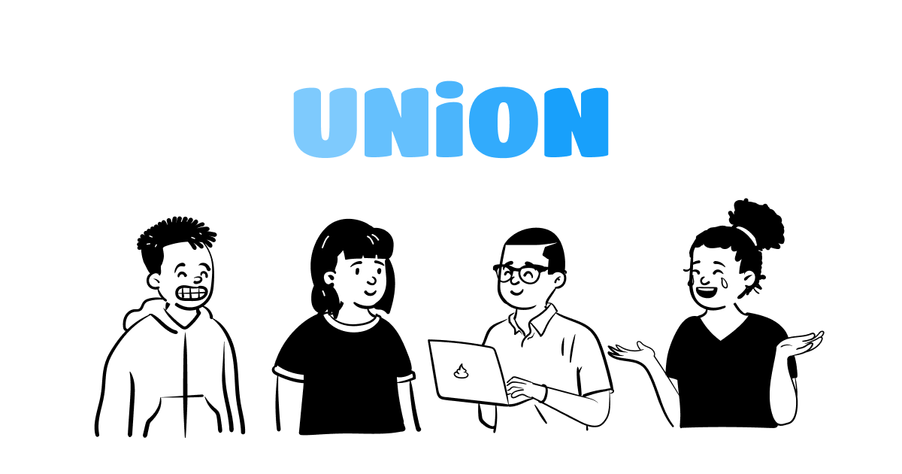
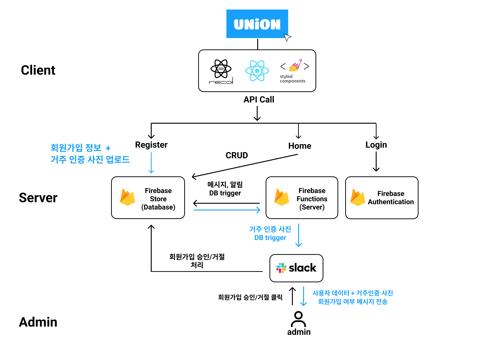
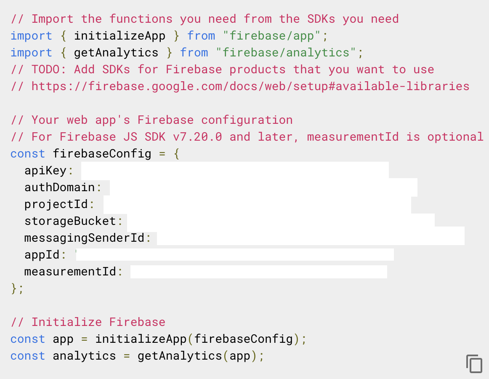

<div align="center">
  <br />
  
  <h1 style="margin:24px">유니온 | 대학생 연합생활관 커뮤니티</h1>
</div>

  <p style="margin:4px 20px;">✔️ https://uni-on.me</p>
  <p style="margin:4px 20px;">✔️ 기숙사 커뮤니티 웹앱</p>
  <p style="margin:4px 20px;">✔️ 2021.09 ~ 운영 관리 중</p>
  <p style="margin:4px 20px;">✔️ 1인 프로젝트</p>
  <p style="margin:4px 20px;">✔ 인증 완료한 가입자 수 <b>178명</b> (2022.04.18 기준)</p>

<br/>

## 목차

1. [웹 서비스 소개](#1)
1. [기술 스택](#2)
1. [주요 기능](#3)
1. [프로젝트 구성도](#4)
1. [프로젝트 데모](#5)
1. [실행 방법](#6)

<br />

<div id="1"></div>

## 웹 서비스 소개

<image src="./readme_assets/union_iphone_mockup.png" width="1000px">

👋 **유니온(UNION)** 은 [대학생연합기숙사](http://naver.me/5uxi2FKd)에 거주하는 학생들을 위한 커뮤니티 웹앱입니다.

✏️ **일상, 스터디, 익명 등 다양한 게시판**에서 자유롭게 글을 작성할 수 있고, 좋아요와 댓글을 남길 수 있습니다. <br/>

🛍 **장터 게시판**에서 기숙사생끼리 편리하게 **물건을 판매**하거나 **무료 나눔**을 할 수 있습니다.<br/>

💬 사용자에게 개인적으로 대화를 하고 싶다면, **메시지 보내기**를 통해 사용자에게 메시지를 보낼 수 있습니다.<br/>

📱 **PWA**로 빌드된 앱을 통해, **iOS와 android** 등 모바일 환경에서 편리하게 **앱으로 접속**할 수 있습니다. <br/><br/>

[**🔗 웹 사이트**](https://uni-on.me/)

[**🔗 Demo**](https://youtu.be/4xeM7bOH1UE)

[**🔗 Github**](https://github.com/tech-hoon/union-community)<br/><br/>

> 💡 새 창에서 열기 : Ctrl+click (CMD+click)

<br />

<div id="2"></div>

## 기술 스택

### **Frontend**

|  |  |  |  |
| :----------------------------------------------------------------------------------------------------------------------------: | :--------------------------------------------------------------------------------------------------------------------------: | :----------------------------------------------------------------------------------------------------------------------------: | :-----------------------------------------------------------------------------------------------------------------------------: |
|                                                             HTML5                                                              |                                                             CSS3                                                             |                                                        JavaScript(ES6+)                                                        |                                                           TypeScript                                                            |

|  |  |  |  |
| :-------------------------------------------------------------------------------------------------------------------------------: | :--------------------------------------------------------------------------------------------------: | :-------------------------------------------------------------------------------------------: | :-------------------------------------------------------------------------------------------------------------------------------------------------------------------------: |
|                                                            React(v17)                                                             |                                                Recoil                                                |                                       styled-component                                        |                                                                                     PWA                                                                                     |

### **Backend**

|  |  |
| :------------------------------------------------------------------------------------------------------------------------------------------------------------: | :----------------------------------------------------------------------------------------------------------------------------------------------------------: |
|                                                                            Firebase                                                                            |                                                                         Google Cloud                                                                         |

<br />

<div id="3"></div>

## 주요 기능

| 기능                | 내용                                                                                                                                     |
| :------------------ | :--------------------------------------------------------------------------------------------------------------------------------------- |
| 게시판, 댓글        | 일상, 스터디, 동아리 게시판 등 다양한 주제로 게시물과 댓글을 남길 수 있습니다. 또한 비밀 게시판에서는 익명으로 글을 남길 수 있습니다.    |
| 장터 게시판         | 기숙사생끼리 편리하게 물건을 거래할 수 있습니다. 특히 나눔과 물물교환 카테고리에서는 사용자끼리 필요한 물건을 주고받을 수 있습니다.      |
| 실시간 메시지, 알림 | 실시간 메시지 기능을 통해, 사용자 간에 편리하게 메시지를 주고 받을 수 있고, 게시물에 댓글이 달리면 알림창에서 알림을 확인할 수 있습니다. |
| 반응형 웹 제공      | PC, 태블릿, 모바일 등 어떤 기기에서든 최적화된 서비스를 이용할 수 있습니다.                                                              |
| PWA                 | PWA로 빌드된 앱을 통해 iOS와 android 등 다양한 모바일 환경에서 앱으로 서비스를 이용할 수 있습니다.                                       |

<br />

<div id="4"></div>

## 프로젝트 구성도

|                                       아키텍처(Architecture)                                       |
| :------------------------------------------------------------------------------------------------: |
|  |

<br />

<div id="5"></div>

## 프로젝트 데모

### 서비스 데모 영상

[**🔗 Youtube**](https://youtu.be/4xeM7bOH1UE)

> 💡 새 창에서 열기 : Ctrl+click (CMD+click)

|                                                                     랜딩 페이지                                                                     |
| :-------------------------------------------------------------------------------------------------------------------------------------------------: |
|  |

<br/>

|                                                                 소셜 로그인 & 회원 가입                                                                 |
| :-----------------------------------------------------------------------------------------------------------------------------------------------------: |
|  |

<br/>

|                                                         Slack + Firebase 회원가입 승인 처리 자동화                                                          |
| :---------------------------------------------------------------------------------------------------------------------------------------------------------: |
|  |

<br/>

|                                                                        실시간 메시지                                                                        |
| :---------------------------------------------------------------------------------------------------------------------------------------------------------: |
|  |

<br/>

|                                                                     PWA 설치                                                                      |                                                                 모바일 반응형 디자인                                                                 |                                                                     장터 게시판                                                                      |
| :-----------------------------------------------------------------------------------------------------------------------------------------------: | :--------------------------------------------------------------------------------------------------------------------------------------------------: | :--------------------------------------------------------------------------------------------------------------------------------------------------: |
|  |  |  |

<br />

<div id='6'></div>

## 실행 방법

**1. 원격 저장소 복제**

```bash
$ git clone https://github.com/tech-hoon/union-community.git
```

**2. 프로젝트 폴더로 이동**

```bash
$ cd union-community
```

**3. 필요한 node_modules 설치**

```bash
$ npm install
```

**4. 프로젝트 실행을 위한 env 파일 작성**

`firebase`에서 프로젝트를 추가하고, 아래처럼 얻은 api key를 토대로 다음과 같이 `.env`파일에 작성



```c
// .env
REACT_APP_FIREBASE_API_KEY=[YOUR_API_KEY]
REACT_APP_AUTH_DOMAIN=[YOUR_AUTH_DOMAIN]
REACT_APP_PROJECT_ID=[YOUR_PROJECT_ID]
REACT_APP_STORAGE_BUCKET=[YOUR_STORAGE_BUCKET]
REACT_APP_MESSAGING_SENDER_ID=[YOUR_MESSAGING_SENDER_ID]
REACT_APP_APP_ID=[YOUR_APP_ID]
REACT_APP_VAPID_KEY=[YOUR_VAPID_KEY]
REACT_APP_COMMIT_REF=[YOUR_COMMIT_REF]
```

**5. 개발 서버 실행**

```bash
# start on localhost:3000
$ npm start
```
